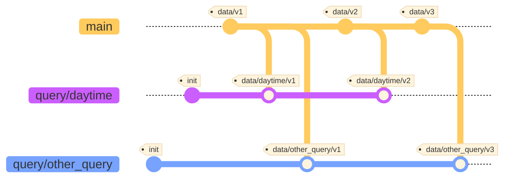

# qdvc - Queried Data Version Control


**Queried Data Version Control** or **QDVC** provides a level of abstraction on `DVC https://github.com/iterative/dvc` 
to offer versions control on data that has been queried and how it was queried.

It offers all the benefits of DVC, with:

- versionning of querrying mechanism
- versionning of data filtered from query


## Getting Started

| Task                  | Terminal                                                                            |
|-----------------------|-------------------------------------------------------------------------------------|
| Add data to pool      | ``$qdvc add images/`` <br/> ``$git commit -m 'new images from customer X' -t v2``   |
| Create new Query      | ``$qdvc query daytime``<br/>``$vim filter.py``                                      |
|                       | ``$qdvc commit``                                                                    |
| Checkout Queried Data | ``$qdvc checkout daytime v2``                                                       |


## The Querying Mechanism

Queries can be based on the filename or n any metadata. For example, you can `add` a TinyDB json file with some metadata for each file.

The file `filter.py` is used to filter files. It looks like:


```python
# filter.py

from tinydb import TinyDB, Query

class Query:
  def __init__(self):
    self.db = TinyDB("metadata.json")
    pass

  def filter(self, filepath: str) -> bool:
    """
    Determines if the file filepath should be kept in the filtered data.
    Looking in the database if the data associated to the file was not collected during the night.
    """
    file = Query()
    return not self.db.search(file.path == filepath).IsNight
```

## How it Works

The dataset is determined by 2 dimensions: the ``query``, and the ``version``:

- the ``version`` indicates the commit hash or tag of the main branch where all the data is commited in a large pool under folder `$GIT_ROOT/.data/`
- a query is a branch out of the main branch with a single commits that defines the filter.py query mechanism.

The dataset queried by `QUERY_NAME` on version `VERSION` is then a branch of name `query/$QUERY_NAME/$VERSION` that is created automatically by QDVC after one runs `qdvc checkout $QUERY_NAME $VERSION`.
To create the branch QDVC iterates through files on `.data/` and applies the filter defined by the user in `filter.py`. It then moves the files outside of the pool to their original locations, and commits them to the branch.


